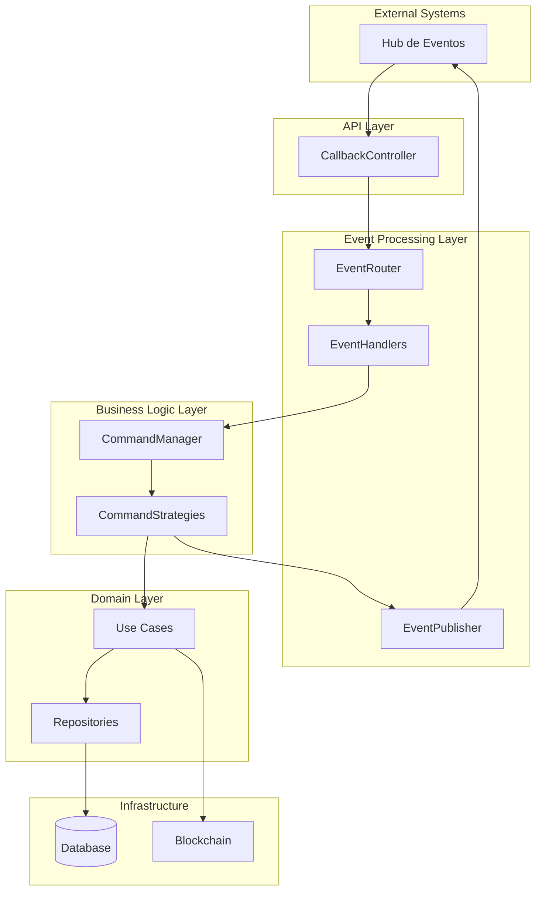
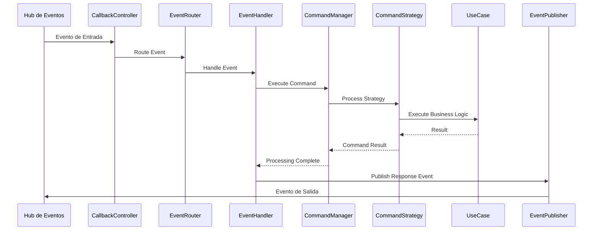

# Event-Driven Architecture para Deliverar Pagos

## Resumen Ejecutivo

Este documento describe la implementación de una arquitectura basada en eventos para el sistema de pagos de Deliverar, que permite manejar eventos de entrada y salida de manera desacoplada y escalable.

## Patrones de Diseño Implementados

### 1. Event-Driven Architecture (EDA)

- **Event Handler Pattern**: Procesa eventos de entrada
- **Event Publisher Pattern**: Publica eventos de salida
- **Event Router**: Dirige eventos a handlers específicos

### 2. Command Pattern

- Encapsula acciones de negocio
- Desacopla lógica de eventos

### 3. Strategy Pattern

- Maneja diferentes tipos de eventos
- Permite extensibilidad

### 4. Observer Pattern

- Notifica múltiples componentes
- Mantiene desacoplamiento

## Arquitectura Propuesta

### Diagrama de Componentes



### Flujo de Eventos



## Implementación

### 1. Estructura de Directorios

```
src/main/java/com/deliverar/pagos/
├── adapters/
│   └── rest/
│       └── messaging/
│           ├── core/
│           │   ├── EventRouter.java
│           │   ├── EventHandler.java
│           │   ├── EventPublisher.java
│           │   └── CommandManager.java
│           ├── commands/
│           │   ├── Command.java
│           │   ├── CommandResult.java
│           │   └── strategies/
│           │       ├── CreateUserCommand.java
│           │       ├── DeleteUserCommand.java
│           │       ├── GetBalancesCommand.java
│           │       ├── GetUserFiatTransactionsCommand.java
│           │       ├── GetUserCryptoTransactionsCommand.java
│           │       ├── FiatDepositCommand.java
│           │       ├── FiatWithdrawalCommand.java
│           │       ├── FiatPaymentCommand.java
│           │       ├── CryptoPaymentCommand.java
│           │       ├── BuyCryptoCommand.java
│           │       ├── SellCryptoCommand.java
│           │       ├── GetAllFiatTransactionsCommand.java
│           │       └── GetAllCryptoTransactionsCommand.java
│           └── events/
│               ├── IncomingEvent.java
│               ├── OutgoingEvent.java
│               └── EventType.java
```

### 2. Tipos de Eventos

#### Eventos de Entrada

1. `USER_CREATION_REQUEST` - Creación de usuario
2. `USER_DELETION_REQUEST` - Eliminación de usuario
3. `GET_BALANCES_REQUEST` - Obtener saldos
4. `GET_USER_FIAT_TRANSACTIONS_REQUEST` - Obtener transacciones fiat de usuario
5. `GET_USER_CRYPTO_TRANSACTIONS_REQUEST` - Obtener transacciones crypto de usuario
6. `FIAT_DEPOSIT_REQUEST` - Ingreso de fiat
7. `FIAT_WITHDRAWAL_REQUEST` - Extracción de fiat
8. `FIAT_PAYMENT_REQUEST` - Pago con fiat
9. `CRYPTO_PAYMENT_REQUEST` - Pago con crypto
10. `BUY_CRYPTO_REQUEST` - Compra de crypto
11. `SELL_CRYPTO_REQUEST` - Venta de crypto
12. `GET_ALL_FIAT_TRANSACTIONS_REQUEST` - Obtener transacciones fiat (sin discriminar por usuario)
13. `GET_ALL_CRYPTO_TRANSACTIONS_REQUEST` - Obtener transacciones crypto (sin discriminar por usuario)

#### Eventos de Salida

- `USER_CREATION_RESPONSE`
- `USER_DELETION_RESPONSE`
- `GET_BALANCES_RESPONSE`
- `GET_USER_FIAT_TRANSACTIONS_RESPONSE`
- `GET_USER_CRYPTO_TRANSACTIONS_RESPONSE`
- `FIAT_DEPOSIT_RESPONSE`
- `FIAT_WITHDRAWAL_RESPONSE`
- `FIAT_PAYMENT_RESPONSE`
- `CRYPTO_PAYMENT_RESPONSE`
- `BUY_CRYPTO_RESPONSE`
- `SELL_CRYPTO_RESPONSE`
- `GET_ALL_FIAT_TRANSACTIONS_RESPONSE`
- `GET_ALL_CRYPTO_TRANSACTIONS_RESPONSE`
- `ERROR_RESPONSE`
